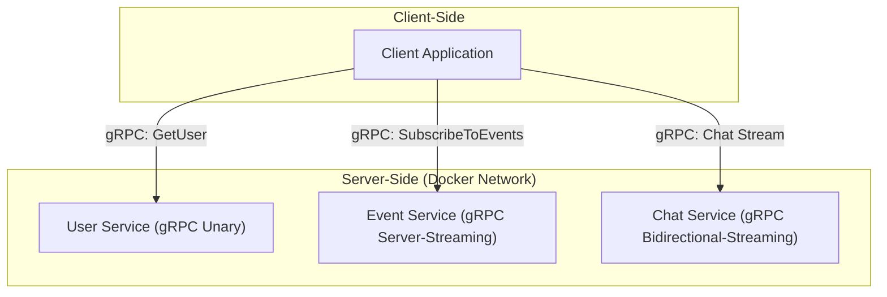
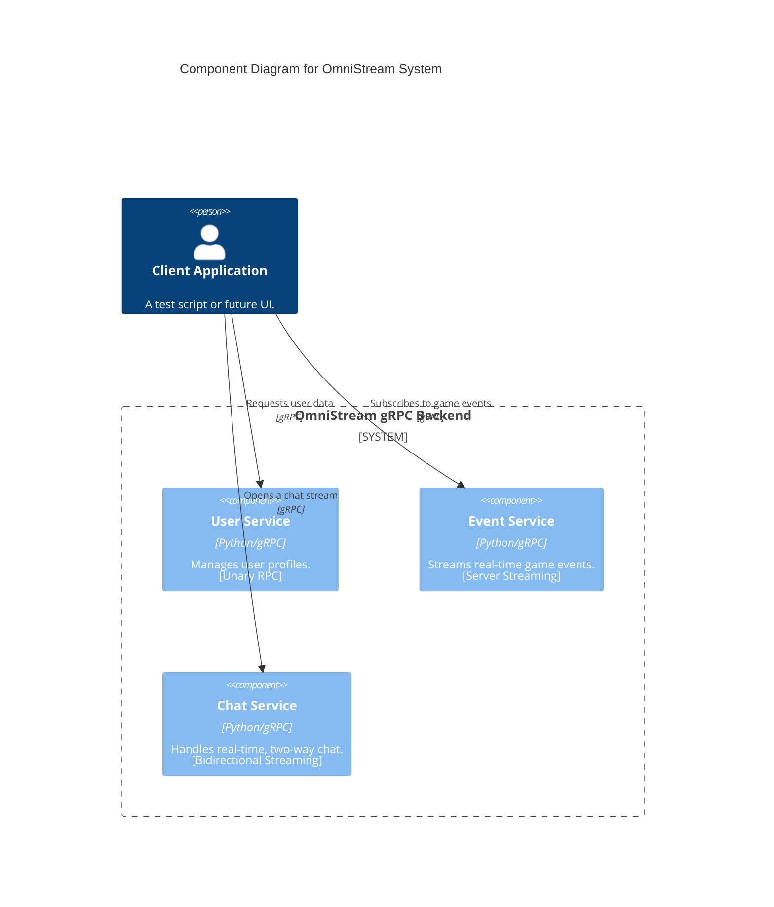
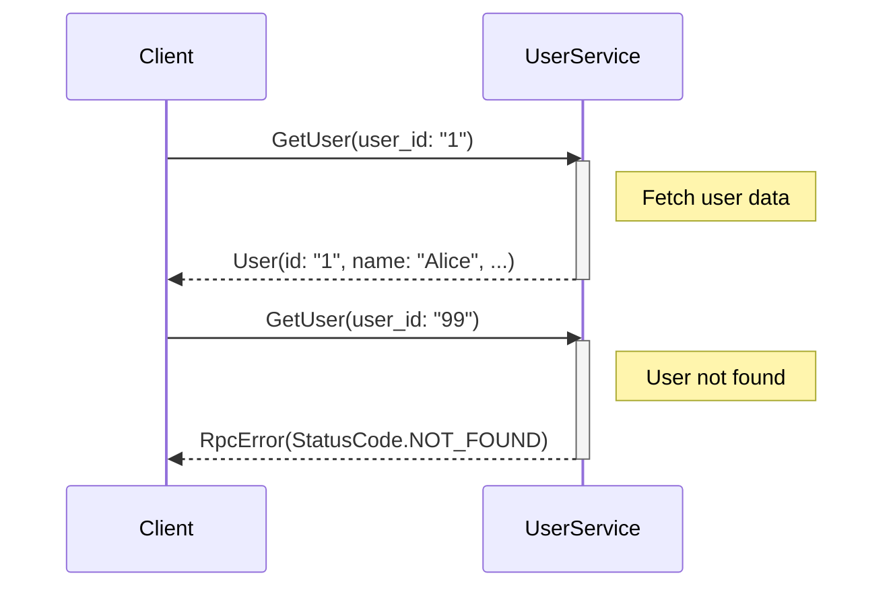
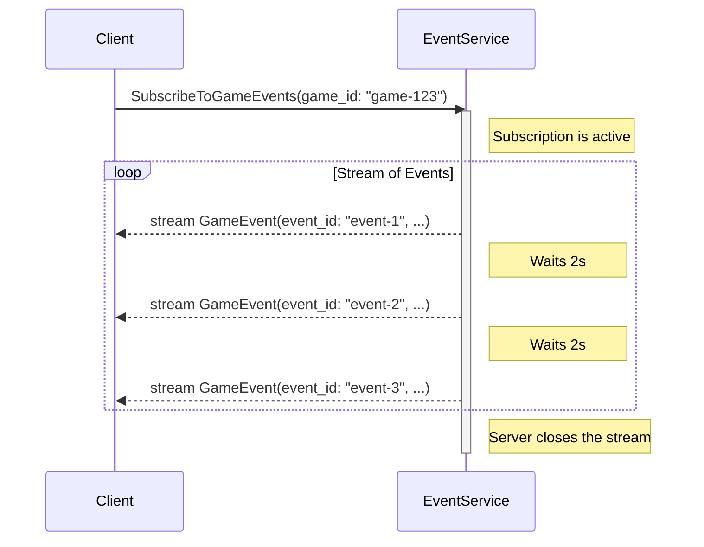
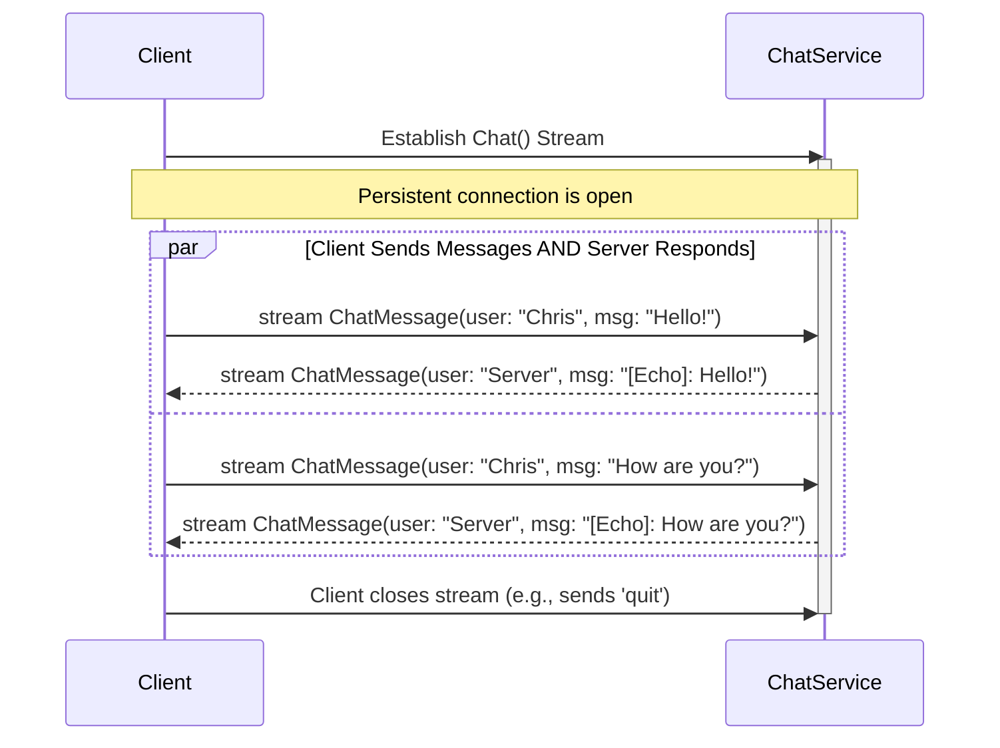
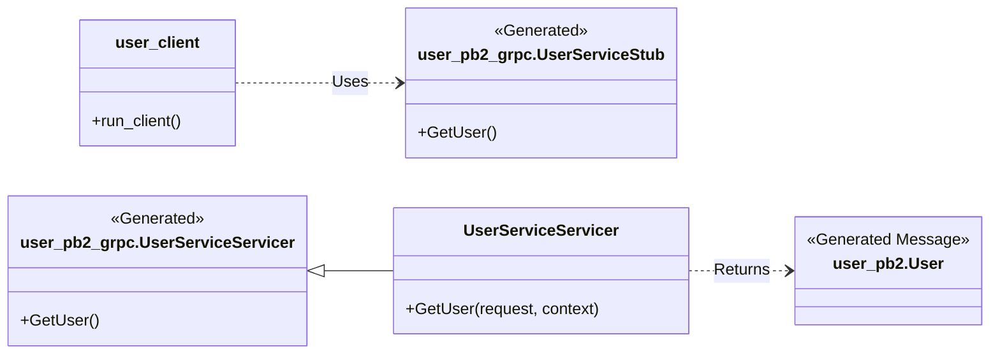
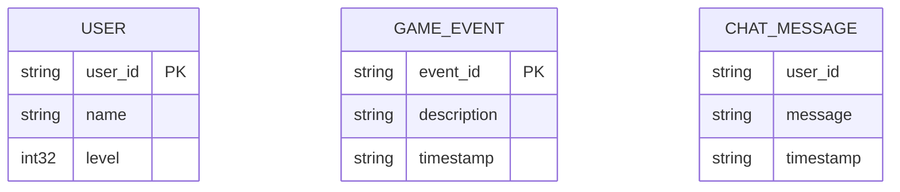
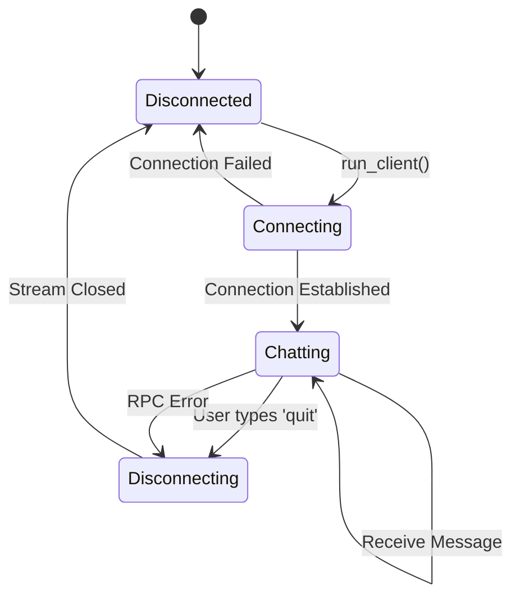

# OmniStream - Architecture & Design Diagrams

This document contains a series of diagrams generated with Mermaid to visually represent the architecture, interactions, and design of the OmniStream gRPC project.

## Table of Contents
1.  [High-Level Architecture Diagram](#1-high-level-architecture-diagram)
2.  [C4 Component Diagram](#2-c4-component-diagram)
3.  [Sequence Diagrams](#3-sequence-diagrams)
    *   [User Service (Unary RPC)](#user-service-unary-rpc)
    *   [Event Service (Server Streaming RPC)](#event-service-server-streaming-rpc)
    *   [Chat Service (Bidirectional Streaming RPC)](#chat-service-bidirectional-streaming-rpc)
4.  [Class Diagram](#4-class-diagram)
5.  [Conceptual Entity Relationship Diagram](#5-conceptual-entity-relationship-diagram)
6.  [State Diagram (Chat Client Lifecycle)](#6-state-diagram-chat-client-lifecycle)

---

### 1. High-Level Architecture Diagram

This diagram provides a simple, high-level overview of the system's components and their primary interactions. It's useful for quickly understanding the overall structure.

### 2. C4 Component Diagram

The C4 model helps to describe a system at different levels of detail. This C2-level (Container/Component) diagram shows our services as running components within the OmniStream system boundary and how a client interacts with them.

### 3. Sequence Diagrams

These diagrams show the step-by-step flow of messages for each of the three gRPC communication patterns.

#### User Service (Unary RPC)

This shows the simple request-response flow of getting a user's profile.

#### Event Service (Server Streaming RPC)

This illustrates the client making one request and the server sending back multiple messages over time.

#### Chat Service (Bidirectional Streaming RPC)

This diagram shows the concurrent, two-way flow of messages in the chat service.

### 4. Class Diagram

This diagram shows the key classes we implemented (`*Servicer`, `*Client`) and their relationships with the gRPC-generated stubs and message classes.

### 5. Conceptual Entity Relationship Diagram

Since this project does not use a database, this ERD visualizes the primary data *entities* (our Protobuf messages) and their attributes in a conceptual way. It is **not** a database schema.

### 6. State Diagram (Chat Client Lifecycle)

This diagram models the different states of the interactive chat client, from connecting to disconnecting.

